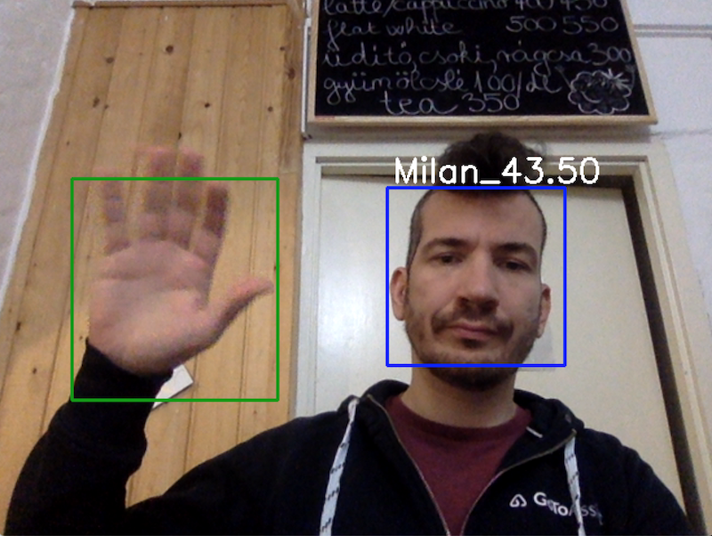

# steamberrysuite

Raspberry Pi based face and motion detection that I use in my cafe.

Works both with Raspberry Cam and  USB Cam.

Needs OpenCV.

Press ESC to exit.
Press Space to train a new face.
Edit dataset/idtoname.txt to assign names to faces.
